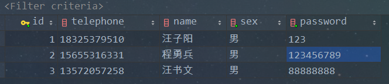
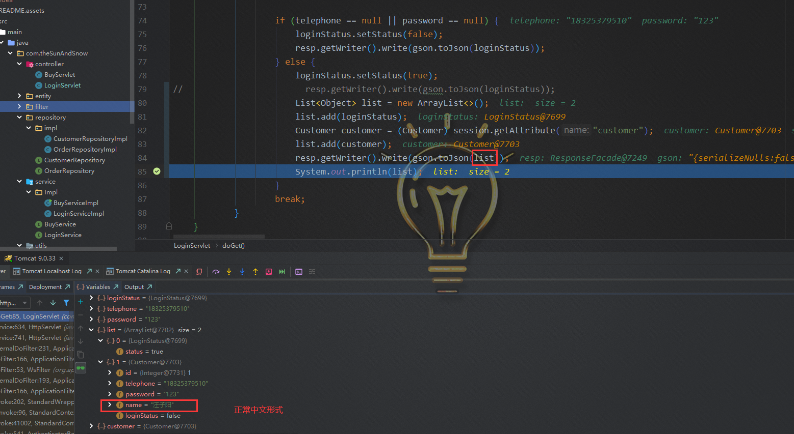
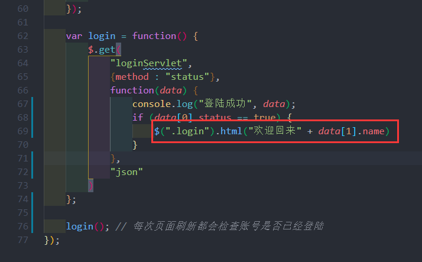
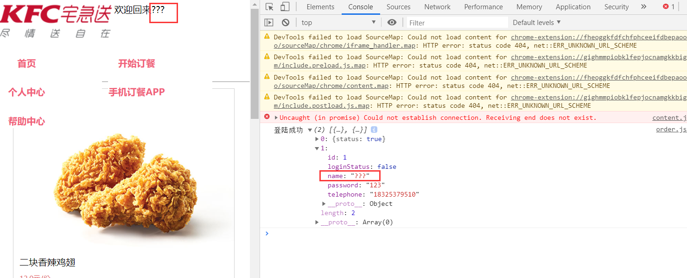
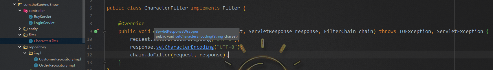
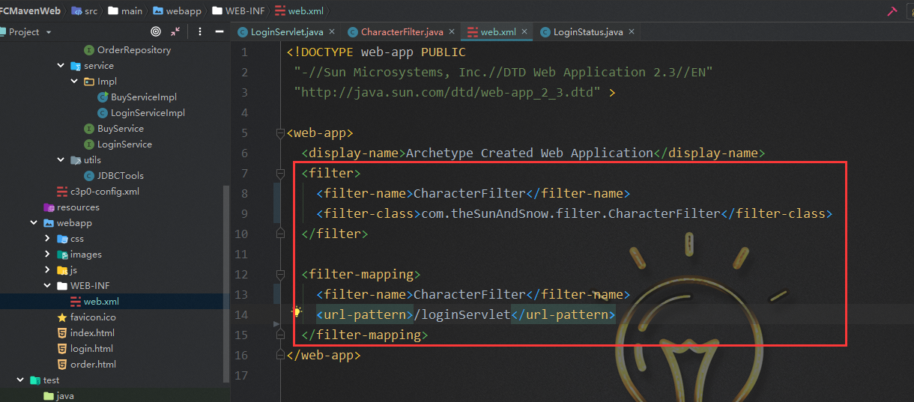
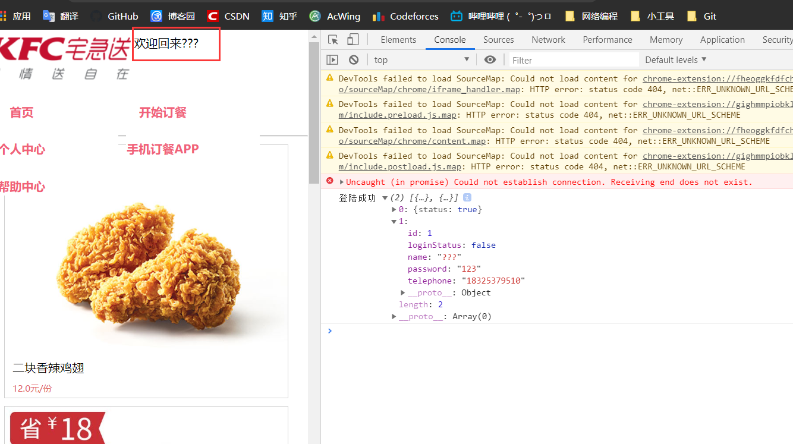

此项目为 IDEA Maven Web 项目。

使用 Tomcat 部署服务器

完全使用 MVC 设计模式

- `M`：Model	    业务数据：service（处理业务逻辑）、repository（与数据库交互）、entity（将从数据库中得到的数据封装成 Java 对象）
- `V`：View          视图。用户可以看到的东西：HTML
- `C`：Controller  控制。Servlet、Handler、Action

请求进入 Java Web 应用后，Controller 接收该请求，进行业务逻辑处理，最终将处理结果的结果 （Model） 返回给用户（View）

并使用 git 进行版本控制。

*********

## 测试

Java 项目在开发过程中一种常见测试类的方法是在被测试的类中写 main 方法，在 main 方法中创建一个 被测试类 即可验证 被测试类 的各种方法。测试获得的用户订单时间 date 转成数据库变量时格式是否正确

```java
public class BuyServiceImpl implements BuyService {

    private OrderRepository orderRepository = new OrderRepositoryImpl();

    @Override
    public void customersBuy(Integer chickenWing, Integer chickenWingSetMeal, Integer beer, Integer hamburger, Integer congee, Integer cola) {
        Date date = new Date(); // 获取当前客户购买时间
        SimpleDateFormat simpleDateFormat = new SimpleDateFormat("yyyy-MM-dd HH:mm:ss");
        String boughtTime = simpleDateFormat.format(date);
        System.out.println(boughtTime);
        //orderRepository.addOrder(chickenWing, chickenWingSetMeal, beer, hamburger, congee, cola, boughtTime);
    }

    public static void main(String[] args) {
        BuyService buyService = new BuyServiceImpl();
        buyService.customersBuy(1, 1, 1,1,1,1);
    }
}
```

控制台输出结果格式与数据库中的 datetime 变量格式一样，没有错误。


### debug

登陆界面写好后，测试正确账号与密码能否正常跳转至 order.html 。发现无法进入。

原因使 loginServlet 服务器请求被取消。

将 login.html 中的 form 表单中的服务器响应地址action 修改后即可解决问题。

修改前：

修改后：

成功进入跳转页面：


在 order.html 中希望可以展示用户名，当后端就数据传递给前端，当时却发现前端接受到的数据存在中文乱码现象。

数据库中用户名：

后端代码：

前端接受到的 name 变量却为：



后来想到后端常用的：可以在后端使用 过滤器 来解决中文乱码问题。

然后新建一个类 CharacterFilter 来设置中文数据格式。

在 xml 文件中设置 filter 映射：


但是结果无效，依旧产生乱码。

